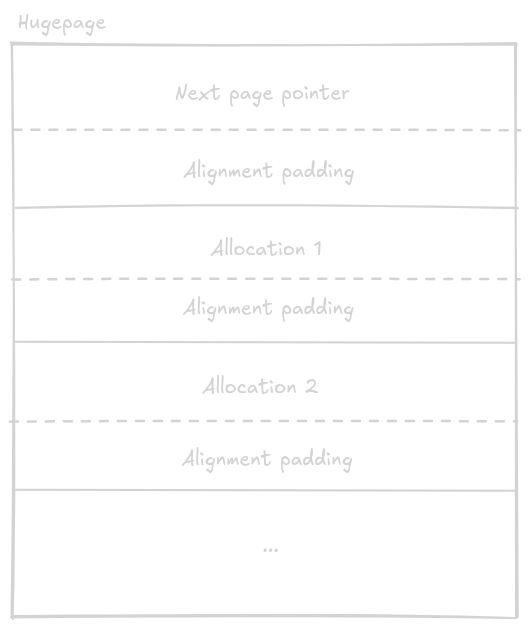

# arena_hugepage_alloc

A small C arena allocator built around Linux hugepages.

> **Status:** Proof of concept / MVP

`arena_hugepage_alloc` is an arena-based allocator that obtains large memory mappings and performs bump-pointer allocation inside them. The current implementation is intentionally small and focused on exploring the fundamentals of huge-page-backed arena allocation.

This project is **Linux-only for now**. Linux is the only platform I currently have access to for development and testing (being a highschool student and all), so the implementation deliberately targets Linux-specific memory facilities. A more portable implementation (as I learn the memory models of other OSes), along with a more general heap huge-page allocator, is planned for the future.

## What it does

The allocator currently supports three page modes:

- **HP** — 2 MiB Linux HugeTLB pages (`MAP_HUGETLB | MAP_HUGE_2MB`)
- **GP** — 1 GiB Linux HugeTLB pages (`MAP_HUGETLB | MAP_HUGE_1GB`)
- **THP** — 2 MiB anonymous mappings marked with `MADV_HUGEPAGE`, requesting Transparent hugepage backing

The allocator is an **arena allocator**: individual allocations are not freed. Instead, the entire arena and all of its pages are released together with `ahfree()`.

## Usage

Include the header and compile the implementation together with your program.

```c
#include "arena_hugepage_alloc.h"
#include <stdio.h>
#include <string.h>

int main(void) {
    arena a = new_HP();

    char *message = ahalloc(&a, 32);
    if (message == NULL) {
        fprintf(stderr, "allocation failed\n");
        return 1;
    }

    strcpy(message, "hello from the arena");
    printf("%s\n", message);

    if (ahfree(&a) != 0) {
        fprintf(stderr, "arena free failed\n");
        return 1;
    }

    return 0;
}
```

Then compile the implementation with your program. For example:

```sh
gcc -std=c23 -O2 -Wall -Wextra -Wpedantic main.c arena_hugepage_alloc.c -o example
```

Clang can be used similarly:

```sh
clang -std=c23 -O2 -Wall -Wextra -Wpedantic main.c arena_hugepage_alloc.c -o example
```

I don't use MSVC enough to know how compilation on it works. (I just looked up the compiler flags for it)

>Note
> 
> I recommend using THPs most often because the number of hugepages on a system are limited, and thus should be used only necessarily. THPs are different; the explanation is a little further down

### Choosing an arena type

Create an arena with one of the constructors:

```c
arena hp  = new_HP();   // 2 MiB HugeTLB pages
arena gp  = new_GP();   // 1 GiB HugeTLB pages
arena thp = new_THP();  // 2 MiB anonymous mappings, MADV_HUGEPAGE
```

Allocate from it with:

```c
void *ptr = ahalloc(&hp, size);
```

A `NULL` return indicates that the arena is invalid, the requested allocation is too large for the selected page type, or a new page could not be obtained.

Free the complete arena with:

```c
ahfree(&hp);
```

After a successful `ahfree()`, the arena is reset to an empty/invalid (`NONE`) state.

## How it works

Each arena starts with one memory page/mapping. A small header at the beginning of every page stores a pointer to the next page in the arena. The remainder of the page is used for allocations.

Conceptually, a page looks like this:



The arena keeps three important addresses:

- `page_addr` — the first page in the arena
- `current_page` — the page currently receiving allocations
- `bump_pointer` — the next free byte in the current page

An allocation is essentially:

```text
return current bump pointer
        ↓
advance bump pointer by the requested size
```

When the current page does not have enough room, a new page of the arena's selected type is mapped and appended to the page chain. Allocation then continues from the new page.

When `ahfree()` is called, the allocator walks the page chain and unmaps every page. This makes freeing an arena independent of the number of individual allocations that were made inside it.

## Alignment

The allocator reserves a page header whose size is rounded to the alignment of `max_align_t`. Allocation sizes are aligned accordingly so that returned addresses maintain the allocator's fundamental alignment guarantee.

## hugepages and system requirements

The **HP** and **GP** modes use Linux HugeTLB mappings. Their success therefore depends on the corresponding huge-page sizes being available on the system.

The **THP** mode is a little more complex. On linux, there are some things called transparent hugepages, which are just normal pages that are contiguous with each other. As I understand, unlike hugepages, which are formed on startup, Linux can make or fragment THPs during runtime. As a result, I recommend this mode most often: you don't want to use up all the hugepages on your system.

If a page mapping fails, the relevant constructor or allocation returns failure rather than inserting the failed mapping into the arena.

## Why an arena allocator?

Arena allocation is useful when many allocations share a lifetime. Instead of tracking and freeing every object independently, an application can allocate related data from one arena and release the entire group at once.

The bump-pointer design also gives the allocation path a very simple memory-access pattern: allocations proceed sequentially through the current page, while older pages are only traversed when the arena is destroyed.

## Platform support

Currently supported:

- Linux

Other platforms are intentionally rejected by the header at compile time. Sorry!
## Contributing

Contributions, bug reports, performance experiments, portability work, tests, documentation improvements, and other ideas are welcome.

This is an early project, so experimentation and constructive feedback are especially appreciated.

## License

This project is released under the MIT License
